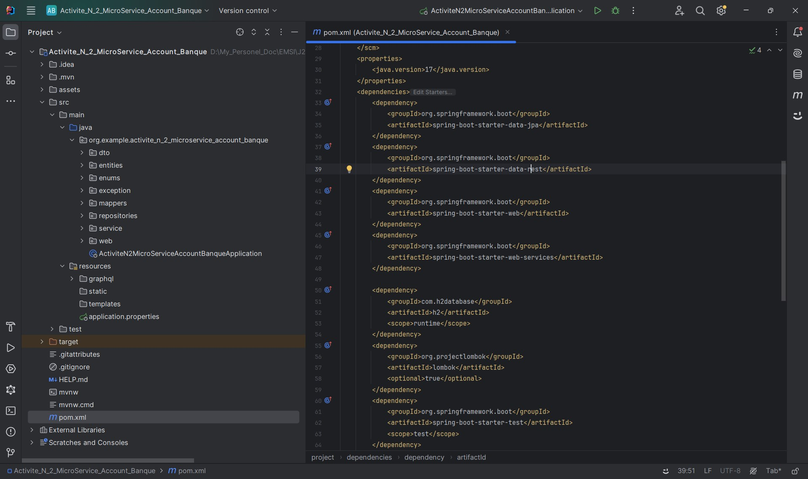

<h2>Compte rendu - Activité Pratique N°2 - Développer un Micro Service</h2>

<h3>1. Créer un projet Spring Boot avec les dépendances Web, Spring Data JPA, H2, Lombok : </h3>

<h3>2. Créer l'entité JPA Compte : </h3>

<h3>3. Créer l'interface CompteRepository basée sur Spring Data : </h3>

<h3>4. Tester la couche DAO : </h3>

<h3>5. Créer le Web service Restfull qui permet de gérer des comptes : </h3>

<h3>6. Tester le web micro-service en utilisant un client REST comme Postman : </h3>

<h3>7. Générer et tester le documentation Swagger de des API Rest du Web service : </h3>

<h3>8. Exposer une API Restful en utilisant Spring Data Rest en exploitant des projections : </h3>

<h3>9. Créer les DTOs et Mappers : </h3>

<h3>10. Créer la couche Service (métier) et du micro service : </h3>

<h3>11. Créer un Web service GraphQL pour ce Micro-service en utilisant cette vidéo comme support : </h3>

